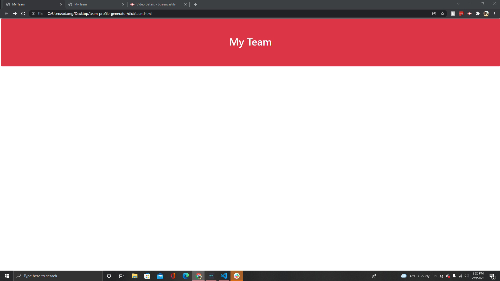

# team-profile-generator

## Deployed Link To The Team Generator
https://adamcg123.github.io/team-profile-generator/

## What Is It 
It is a team generator that allows you to make a team and will give their names, job title, their ID, office number, 
School that they go to, github account links and Emails.

## How Does It Work
when using it, it takes the questions that you filled out in the terminal that were taken from the index.js file then it inputs that data into the template then the 
output is the team.html file.

## Some Of The Tech Used

html, css , javascript, json, node, and jest

## On Startup 
When you first go to the team.html file it will look like this

the tutorial below is how to use the app and populate it with data

## Tutorial

the tutorial vid is in the assets/images folder

